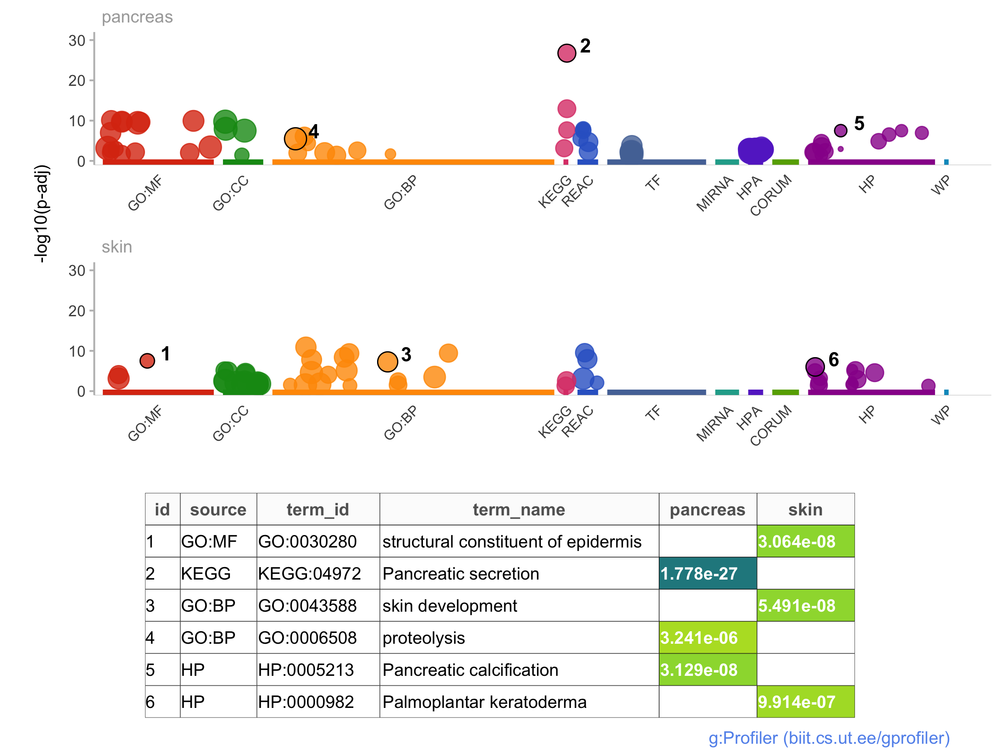

# r-gprofiler2

An R interface corresponding to the 2019 update of g:Profiler web tool.

## Installation

`install.packages("gprofiler2")`
`library(gprofiler2)`

### g:GOSt Manhattan plot example generated in R

